# 迹记 - 智能地理日记应用

## **一、基础信息**

### **1.1 作品概述**

迹记是一款基于 HarmonyOS NEXT 的智能地理日记应用，深度集成高德地图开放平台，将日记与地理位置结合实现时空可视化。记录时自动定位与逆地理编码，足迹地图一眼看清去过的地方。产品遵循“自动化、可视化、智能化”三原则：最少输入完成定位与同步、以地图/时间线呈现脉络、用 AI 助手快速检索回忆，适用于旅行、通勤、生活记录。

### **1.2 主要软件与工具**

| 类别 | 技术 / 工具 | 用途 |
| :- | :- | :- |
| 前端框架 | ArkTS + ArkUI | 声明式 UI 开发，响应式状态管理 |
| 运行平台 | HarmonyOS NEXT | 设备运行环境与系统能力 |
| 地图服务 | 高德地图 SDK（`amap_lbs_map3d`、`amap_lbs_location`） | 3D 地图、定位、逆地理编码 |
| 数据存储 | Preferences + 云端 MySQL | 本地优先与增量同步存储方案 |
| 登录与账号 | 华为账号 | 账号登录与用户标识 |

## **二、操作方法**

### **（一）新用户登录与引导**
1. 打开应用进入首页
2. 点击“登录”，完成华为账号授权
3. 首次添加日记将触发定位权限请求

| 登录界面 | 注册界面 |
| --- | --- |
| 
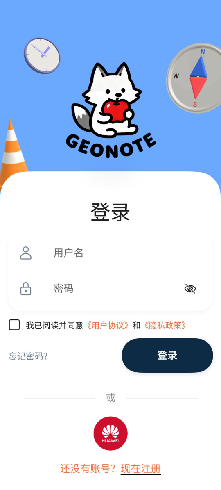 账号登录授权入口
 | 
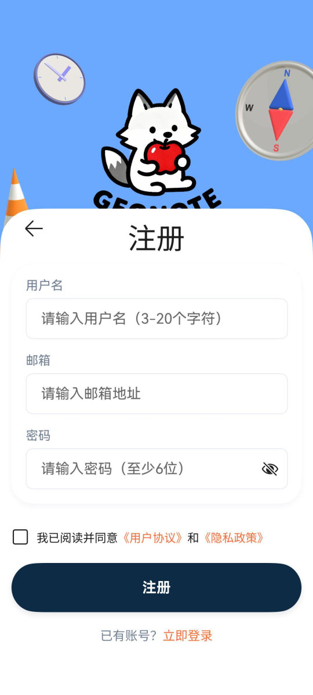 首次注册信息填写
 |

### **（二）主要功能页面操作流程**
#### 1. 首页（时间线）
- 显示按日汇总的日记卡片，内嵌小地图预览当天轨迹
- 点击卡片进入详情，支持编辑/删除

| 首页（时间线） | 轨迹时间轴 |
| --- | --- |
| 
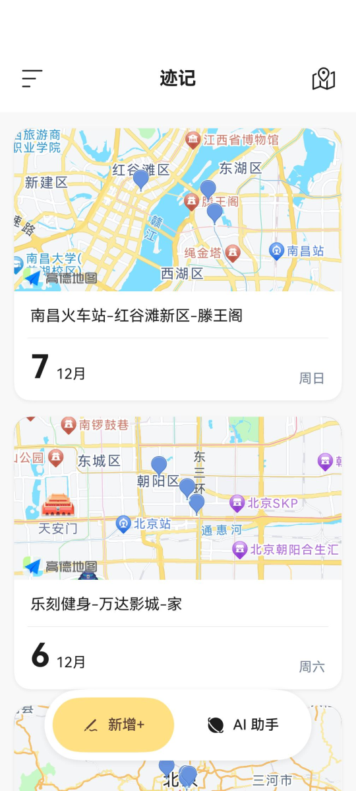 按日汇总时间线，卡片内嵌小地图预览
 | 
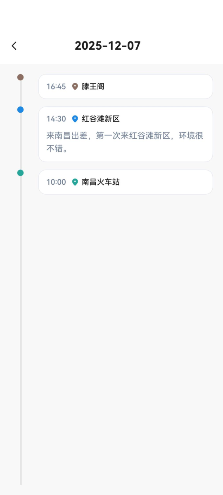 按日串联行动轨迹，小地图预览
 |

#### 2. 添加日记
- 打开即自动定位，优先显示 POI 名称（如“万达广场”）
- 输入内容，保存后写入地点、地址、经纬度四个字段

<table>
  <tr>
    <th>添加日记</th>
    <th>编辑日记</th>
  </tr>
  <tr>
    <td align="center">
      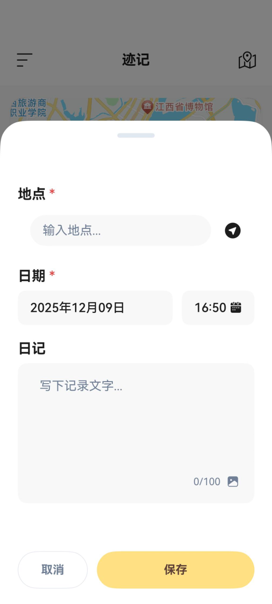 
      自动定位优先显示 POI，填写内容一键保存
    </td>
    <td align="center">
      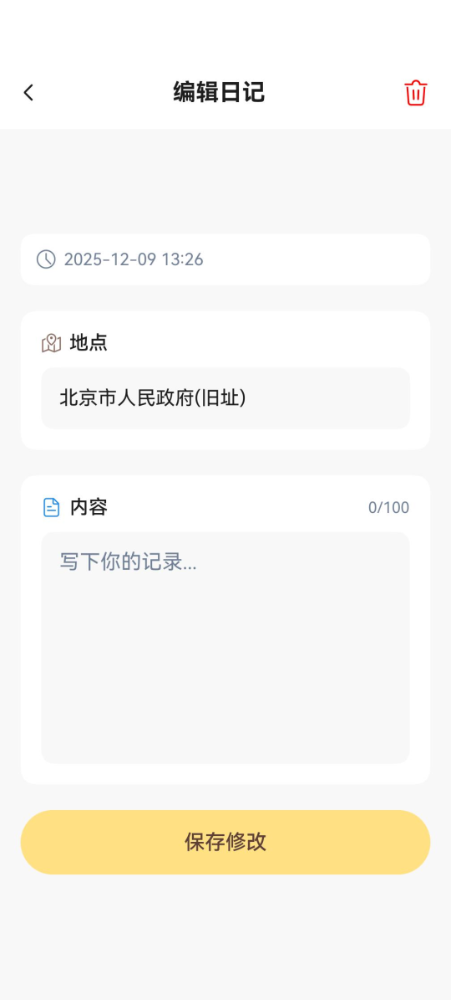 
      支持修改地点与内容，保持地理信息同步
    </td>
  </tr>
  </table>

#### 3. 足迹地图
- 多级聚合：缩放级别自动切换 省 → 市 → 区县 → 地点
- 点击标记查看对应日记，支持移动与缩放

| 足迹地图-省级 | 足迹地图-市级 |
| --- | --- |
| 
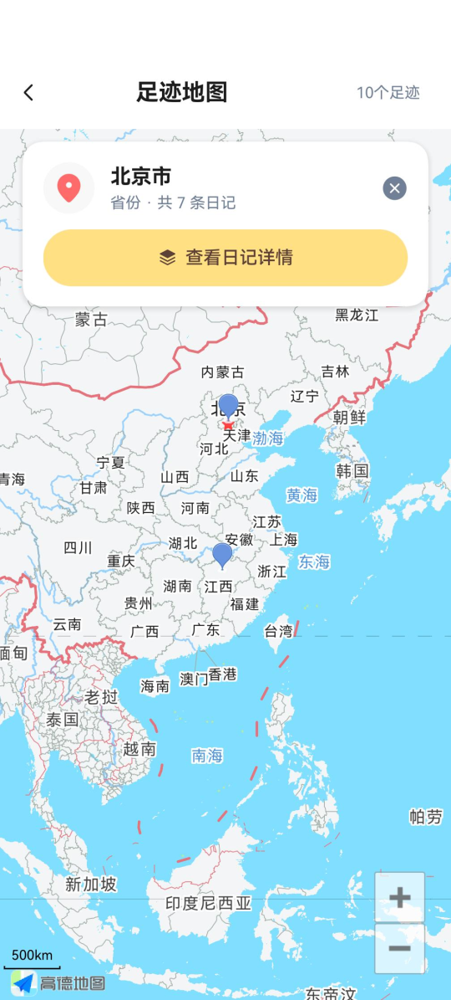 按省份聚合，概览全局足迹
 | 
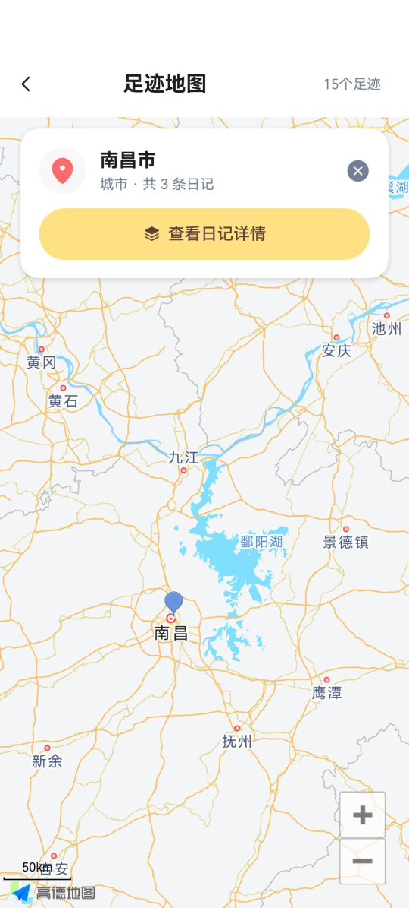 按城市聚合，逐级放大查看
 |
| 足迹地图-区级 | 聚合日记查看 |
| 
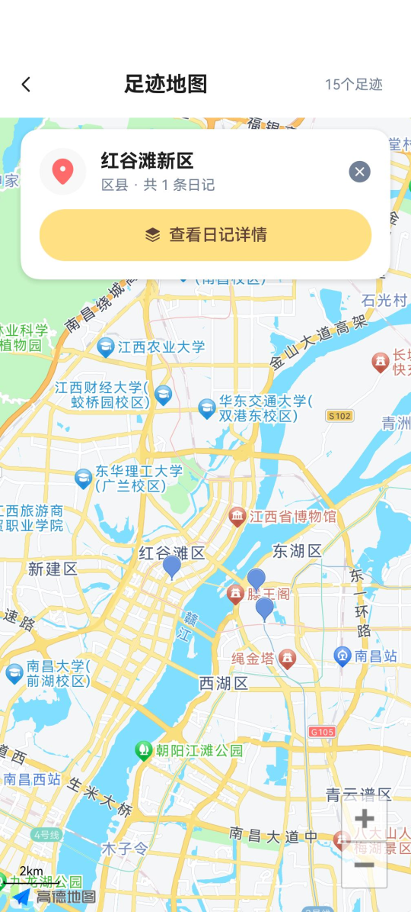 按区县聚合，定位更精细
 | 
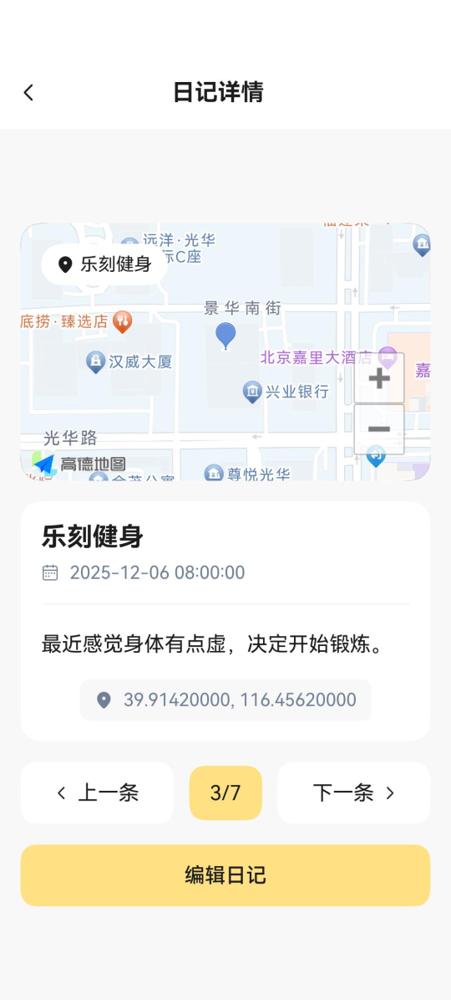 点击聚合点查看包含的日记清单
 |

#### 4. AI 助手
- 支持“总结本周行程”“今年去过哪些地方”等自然语言检索

| 预设提示 | AI 助手 |
| --- | --- |
| 
 一键提问模板，快速发起常用查询
 | 
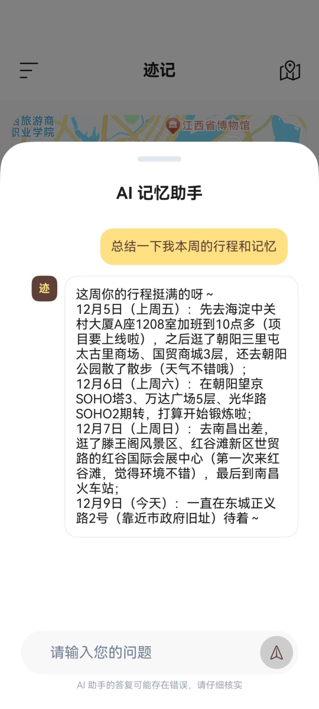 自然语言对话与结果展示
 |

#### 5. 个人中心
- 账号信息与设置入口

### **（三）数据同步与管理**
- 本地优先：离线可用，网络恢复自动增量同步
- 超时与降级：定位超时 10 秒静默降级
- 权限与隐私：定位仅用于日记地理信息记录

## **三、技术架构**

### 3.1 分层设计
本项目采用标准的分层架构设计 (Layered Architecture)，遵循“关注点分离”原则，将应用自上而下划分为表现层、业务逻辑层、服务层与数据层。这种设计确保了代码的高内聚低耦合，便于后期维护与功能扩展。

  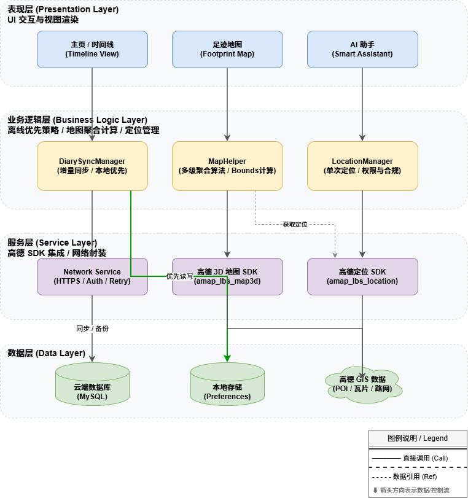

### 3.2 高德地图 API 调用

#### 地图显示（`amap_lbs_map3d`）

| 能力 | API |
| :- | :- |
| 初始化 | `MapsInitializer.setApiKey` |
| 地图组件 | `MapViewComponent` |
| 相机控制 | `AMap.moveCamera` / `animateCamera` |
| 标记添加 | `AMap.addMarker` |
| 事件监听 | `AMap.setOnMarkerClickListener` |
| 视角变化监听 | `AMap.setOnCameraChangeListener` |
| 清理 | `AMap.clear` |

#### 定位服务（`amap_lbs_location`）

| 能力 | API |
| :- | :- |
| 初始化 | `AMapLocationManagerImpl.setApiKey` |
| 单次定位 | `requestSingleLocation` |
| 逆地理定位 | `locatingWithReGeocode` |
| 逆地理字段 | `location.reGeo.poiName` / `address` |

## 4. 创新点

1. **地图 × 日记深度融合**：记录即落点，自动带出地点名称/地址/经纬度；卡片内嵌小地图，所见即所得
2. **多级聚合 + 清单联动**：省/市/区/地点四级聚合，点击聚合点直达所含日记清单，高效探索
3. **时间轴轨迹串联**：按日串联行动轨迹，小地图预览与详情联动，便捷回顾当天动线
4. **AI 总结与地理语义检索**：预设提示一键发问，支持“本周足迹总结/地点TOP/按城市区域筛选”等
5. **离线友好记录**：断网可写、前台立即可见，恢复后自动增量同步

## 6. 用户价值

- **更省心的记录**：打开即定位，自动带出地点信息，最少输入完成一条地理日记。
- **更清晰的回顾**：时间线 + 地图双视角，四级聚合与清单直达，快速定位关键片段。
- **更智能的洞察**：AI 一键总结行程、地点 TopN、跨城市对比，支持地理语义检索。
- **更可靠的可用性**：离线可写、前台可见，恢复自动同步，不因网络问题丢内容。
- **更顺手的分享**：地图视图与清单结果便捷导出，适合社交分享与留存备份。

## 7. 使用场景

- **旅行记录**：按天记录行程，回看目的地分布与动线，生成旅行总结与城市榜单。
- **通勤与生活**：工作日轨迹与常去地点统计，发现通勤规律与活动半径。
- **学习与打卡**：图书馆、自习室、咖啡店学习日记，城市/区域筛选一目了然。
- **美食与探店**：餐厅足迹地图，按城市/商圈聚合；AI 总结本月最常去餐厅。
- **亲子与成长**：家庭出行足迹、活动地点记录，按时间线回顾成长轨迹。

## 7. 总结

迹记通过高德地图开放平台实现智能定位、地址解析、足迹可视化、多层级聚合等功能，采用离线优先架构和响应式设计，让用户以地理视角记录和回顾生活，让每一段回忆都有迹可循。
